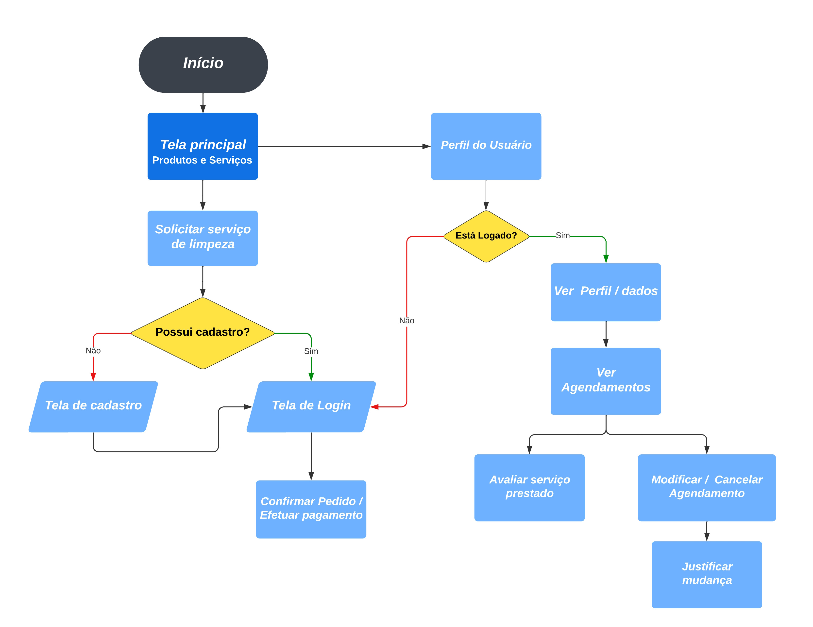

# Projeto de Interface

Pré-requisitos: <a href="2-Especificação do Projeto.md"> Documentação de Especificação</a>

Visão geral da interação do usuário pelas telas do sistema e protótipo interativo das telas com as funcionalidades que fazem parte do sistema (wireframes).

 Apresente as principais interfaces da plataforma. Discuta como ela foi elaborada de forma a atender os requisitos funcionais, não funcionais e histórias de usuário abordados nas <a href="2-Especificação do Projeto.md"> Documentação de Especificação</a>.

## Diagrama de Classe

O diagrama de classes é uma representação visual essencial do nosso projeto de aplicativo de lava-jato. Esse diagrama descreve as principais entidades e objetos do sistema, bem como os relacionamentos entre eles, fornece um mapa claro da estrutura do nosso aplicativo.

## Diagrama de Fluxo

O diagrama abaixo apresenta o estudo do fluxo de interação do usuário com o sistema interativo.

## Wireframes
Protótipos usado em design de interface para sugerir a estrutura de uma aplicação web e seu relacionamentos entre suas páginas. Um wireframe web é uma ilustração semelhante do layout de elementos fundamentais na interface. O wireframe desta aplicação interativa é apresentado abaixo:

